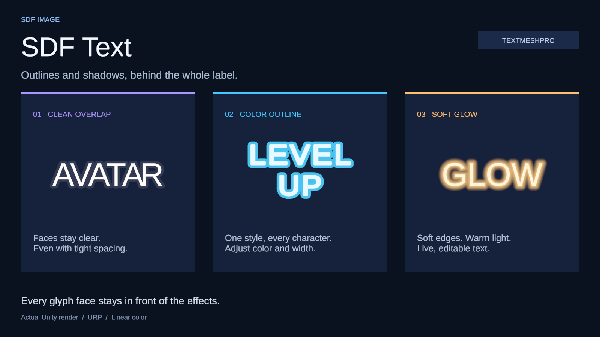
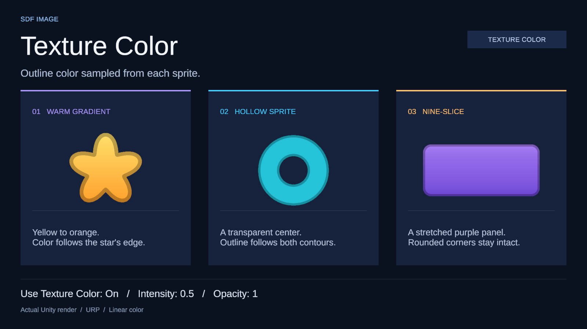

# SDF Image

Outline và shadow cho **Unity 6 / uGUI (Canvas)**, gồm sprite và chữ TextMeshPro. Thư viện độc lập, dùng uGUI 2.0 cùng TextMeshPro đi kèm.

## Dùng nhanh

1. Tạo **GameObject → UI → SDF Image**. Chỉ có một component `SdfImage`, kế thừa `UnityEngine.UI.Image`.
2. Gán sprite gốc vào **Source Image** ngay trên component này.
3. Nếu sprite chưa có SDF, nhấn **Generate SDF**. Ảnh vẫn hiển thị bình thường trong lúc chờ.
4. Các thuộc tính Image hiện trực tiếp theo Inspector chuẩn Unity: **Source Image**, **Color**, **Material**, Raycast, Maskable, Image Type và các tuỳ chọn theo kiểu ảnh; không bọc trong group, không cần chờ Generate.
5. Khi **SDF ready**, Inspector hiện thêm **Outline** và **Shadow** bên dưới. Bật toggle nào thì nhóm đó hiện thông số; tắt sẽ giữ giá trị để lần sau bật lại. **SDF Settings** được thu gọn mặc định.

Cấu hình thuộc **texture nguồn**, áp dụng cho mọi sprite con trong texture đó. Gán sprite thường không tự bake. Nút Generate SDF bật **Auto Update**: những lần đổi ảnh, thông số import hoặc cấu hình SDF sau đó sẽ tự cập nhật. Có thể chỉnh Auto Update trong SDF Settings hoặc bật Generate SDF ở Inspector của texture gốc.

Nút **Cancel** hoặc tắt Auto Update huỷ công việc đang chờ/đang chạy và dừng tạo mới. Kết quả đã hoàn thành được giữ lại. Muốn tắt hiệu ứng thì tắt toggle **Outline** / **Shadow**; tắt cả hai sẽ dùng đường render Image bình thường.

Trong **Outline**, bật **Use Texture Color** để lấy màu RGB từ texture làm màu viền. **Intensity** bằng `0` cho viền đen, `1` giữ màu gốc, lớn hơn `1` làm sáng hơn; **Opacity** chỉnh alpha của viền riêng. Khi tắt, viền dùng **Color** như trước và giữ lại các thiết lập đã nhập. Chế độ này không cần bake lại SDF đã có.

Component `SdfAutoBake` cũ được giữ để các prefab cũ vẫn tải được. Image sẽ tiếp nhận source đã lưu; nút **Remove Legacy Auto Bake** trong Inspector bỏ helper thừa với Undo. Object tạo mới không cần helper này.

## TextMeshPro

1. Tạo **GameObject → UI → SDF Text**. Component `SdfText` kế thừa `TextMeshProUGUI`, giữ Inspector chuẩn TMP để chỉnh nội dung, font, cỡ chữ, alignment, spacing, auto size và rich text.
2. Gán font TMP dùng atlas SDF. Không cần Generate SDF hoặc bake chữ thành sprite.
3. Bật **Outline** hoặc **Shadow** trong phần **SDF Effects** bên dưới Inspector. Width, softness, offset, blur và spread dùng đơn vị local của Canvas.

Toàn bộ shadow được vẽ trước, sau đó toàn bộ outline, cuối cùng là mặt chữ. Viền của ký tự vẽ sau không đè lên mặt ký tự bên cạnh, kể cả khi chữ sát nhau hoặc dùng fallback font/nhiều material. Component dùng mesh và font atlas hiện tại của TMP, tự cập nhật khi đổi nội dung, layout hoặc font lúc runtime. Hiệu ứng Outline/Underlay/Glow gốc của TMP được tắt trên material render riêng; font và material nguồn không bị sửa.



Ba mẫu dùng cùng component `SdfText`: outline và shadow sau chữ sát nhau, viền màu cho label nhiều dòng, và glow tạo từ shadow không có offset. Ảnh được render trực tiếp trong URP Linear. Xem thêm [ảnh kiểm tra chữ sát nhau và báo cáo render](VALIDATION.md).

Với label TMP có sẵn, tạo **SDF Text** mới, gán lại font, nội dung và thiết lập layout rồi cập nhật các tham chiếu sang component mới. Chưa có công cụ tự chuyển component TMP cũ; không thay trực tiếp script của TMP trong scene hoặc prefab.

`SdfText` vẫn gán được vào field `TMP_Text` hoặc `TextMeshProUGUI`; tiếp tục dùng `text`, `SetText`, `font`, `fontSize` và API TMP thông thường:

```csharp
using SDFUI;
using UnityEngine;

public sealed class ScoreLabel : MonoBehaviour
{
    [SerializeField] private SdfText label;

    public void SetScore(int score)
    {
        label.SetText("Score: {0}", score);
        label.OutlineEnabled = true;
        label.OutlineWidth = 2;
        label.OutlineColor = Color.black;
        label.ShadowEnabled = true;
        label.ShadowOffset = new Vector2(0, -3);
        label.ShadowBlur = 2;
    }
}
```

- Chỉ hỗ trợ `TextMeshProUGUI` trên Canvas, chưa hỗ trợ `TextMeshPro` 3D hoặc shader font tuỳ biến không dùng SDF.
- Độ rộng/blur bị giới hạn bởi padding và distance range đã có trong font atlas. Nếu hiệu ứng ngừng rộng thêm, tạo lại font atlas với padding lớn hơn; thay thông số bake sprite không ảnh hưởng font.
- Hỗ trợ Canvas cha, `Mask`, `RectMask2D` và `CanvasGroup` trong hierarchy. Đặt `Canvas`, `Mask` và `RectMask2D` ở object cha, không đặt trực tiếp trên object chữ; trường hợp này sẽ tắt hiệu ứng SDF.
- Có thêm lớp render và material cho hiệu ứng, theo các material font đang dùng. Chữ nhiều fallback font hoặc shadow lớn sẽ tăng draw call/overdraw.

## Texture nằm trong sprite gốc

Texture màu có padding, texture distance và mô tả `SdfSprite` là các subasset của **chính file ảnh nguồn**. Mô tả còn được gắn trực tiếp vào Sprite bằng API `Sprite.AddScriptableObject` của Unity 6; `SdfSprite.FromSprite(source)` lấy lại dữ liệu này trong player.

Không tạo `.asset`, PNG SDF hay thư mục ảnh bake riêng trong Assets. Cache tạm nằm ở `Library/SDFImage`, không cần đưa vào Git. Commit file ảnh nguồn, `.meta` của nó và thư viện. Máy mới tự bake lại những nguồn đã bật SDF khi Unity import. File ảnh gốc và các thiết lập import hình ảnh được giữ nguyên; cấu hình SDF thêm vào `TextureImporter.userData`, giữ nội dung trước đó.

`Image.sprite` giữ tham chiếu đến Sprite gốc trong player để tìm dữ liệu đính kèm. Runtime không chạy thuật toán bake. Chờ Ready trước khi build nguồn đã bật Auto Update; build kiểm tra image trong các scene được bật, Resources, preloaded assets và các prefab phụ thuộc. Sprite chưa Generate dùng Image bình thường.

## Bake có giới hạn và có thể huỷ

- Giảm kích thước **trước** khi tính distance; Max Size mặc định 512, chọn 64–1024. Không thay kích thước texture nguồn.
- Đọc GPU bằng `AsyncGPUReadback`, tính distance tuyến tính theo số pixel trên một worker. Không gọi đọc GPU đồng bộ hoặc chờ worker trên main thread.
- Chỉ chạy một job mỗi lúc. Đổi cấu hình huỷ kết quả cũ; chỉ thế hệ hiện hành mới được publish.
- Cache theo nguồn, Sprite ID và cấu hình; import lại dữ liệu đã hợp lệ không bake lặp.
- Mỗi texture tối đa 128 sprite hoặc 4 triệu texel sau padding. Vượt giới hạn sẽ báo lỗi để giảm Max Size/padding, trước khi cấp phát bộ đệm bake lớn.
- Main thread vẫn tạo tài nguyên GPU và publish subasset qua Unity import; bước import có thể khựng ngắn tuỳ máy. Không có cam kết tuyệt đối không khựng hay số FPS chưa đo.

Editor cần graphics device hỗ trợ AsyncGPUReadback. Chạy `-nographics` không tạo được SDF mới. GPU chỉ dùng để lấy ảnh nhập thực tế, bao gồm cấu hình alpha/import; nguồn không cần bật Read/Write.

## Hiệu ứng và giới hạn

- Outline ngoài/trong/giữa, width, color và softness; shadow có offset, blur, spread. Offset bằng 0 và shadow màu sáng tạo glow.
- **Use Texture Color** thay RGB của outline bằng RGB texture × Intensity; không nhân thêm RGB của Outline Color hoặc Image Color. Alpha vẫn dùng Outline Color/Opacity và alpha toàn bộ Image như trước. Intensity không thay đổi alpha.
- Giữ RGB/alpha nguồn cho phần fill. `Graphic.color` tint fill, alpha làm mờ toàn bộ hình và hiệu ứng một lần.
- Simple, preserve aspect và nine-slice; layout, native size; quad mở rộng để không cắt outline/shadow.
- Hỗ trợ `Mask`, `RectMask2D` (cả softness), `CanvasGroup`; vùng nhận raycast vẫn là RectTransform gốc.
- SDF Image hỗ trợ Simple và Sliced với Fill Center. Filled/radial fill, Tiled và Sliced tắt Fill Center dùng Image Unity bình thường, không có hiệu ứng SDF. Hỗ trợ chữ qua `SdfText` như phần TextMeshPro ở trên. Chưa tích hợp SpriteRenderer, UI Toolkit, Coffee SoftMask/UIEffect.

Width/softness/offset/blur/spread dùng **đơn vị local của Canvas**. Padding và Distance Range dùng **pixel của ảnh SDF sau giảm kích thước**. Shader giới hạn hiệu ứng theo lượng padding/distance có sẵn; tăng padding và range nếu viền ngừng rộng thêm. Offset shadow độc lập với giới hạn distance. Biến đổi Canvas/object sẽ scale cả hiệu ứng.

Field dùng RHalf tuyến tính, distance dương ở trong hình. Thuật toán tính khoảng cách Euclidean đến lớp alpha đối diện, hiệu chỉnh nửa pixel. Alpha Threshold xác định đường biên. Đây là SDF từ raster, không tái dựng vector/MSDF; tăng Max Size giúp giữ chi tiết nhỏ.

Mỗi image có material riêng, không gom batch với các image dùng material khác. Shader lấy ba mẫu texture mỗi fragment. Shadow lớn tăng vùng overdraw. Texture không mipmap/compression: RGBA32 + RHalf khoảng 6 byte/texel GPU, và dữ liệu CPU đọc được khoảng 6 byte/texel nữa, chưa tính texture nguồn và overhead. Ảnh 256×256 với padding 32 dùng khoảng 600 KiB cho mỗi phía GPU/CPU.

## API

```csharp
using SDFUI;
using UnityEngine;

public sealed class ButtonStyle : MonoBehaviour
{
    [SerializeField] private SdfImage image;
    [SerializeField] private Sprite icon; // Đã bật Generate SDF trong Editor.

    private void Awake()
    {
        image.sprite = icon; // API Image chuẩn, cũng hỗ trợ overrideSprite.
        image.OutlineEnabled = true;
        image.OutlineWidth = 4;
        image.OutlineColor = Color.white;
        image.OutlinePosition = SdfOutlinePosition.Outer;
        image.ShadowEnabled = true;
        image.ShadowColor = new Color(0, 0, 0, 0.35f);
        image.ShadowOffset = new Vector2(0, -6);
        image.ShadowBlur = 10;
    }
}
```

`SdfImage` kế thừa `Image`, có thể gán vào field `UnityEngine.UI.Image` hoặc Button Target Graphic. `image.sprite` và `image.overrideSprite` tự tìm dữ liệu SDF tương ứng, kể cả đổi sprite trong cùng một sheet. API cũ `image.Sprite` nhận `SdfSprite` vẫn còn để tương thích; code mới dùng `image.sprite` và `image.SdfData`. Với Button, bật Raycast Target; Canvas cần GraphicRaycaster/EventSystem như uGUI thông thường.

Để dùng màu texture cho viền, đặt `image.OutlineUseTextureColor = true` và `image.OutlineTextureColorIntensity = 1f`. Mặc định chế độ này tắt; intensity mặc định `1`, nhận giá trị từ `0` trở lên. `image.OutlineColor.a` vẫn điều khiển opacity; RGB của `Image.color` chỉ tint phần fill.

## Demo, cài đặt và kiểm thử

**Tools → SDF Image → Create Demo Prefab** tạo mẫu riêng trong `Assets/SDFImageDemo`, gồm ba ảnh nguồn bật SDF và prefab minh hoạ outline, shadow, glow, Sliced, RectMask2D. Chờ Ready rồi kéo prefab vào scene trống. Lệnh không sửa scene đang mở.



Ba ví dụ bật **Use Texture Color**, dùng **Intensity 0.5** và **Opacity 1**: màu viền theo gradient của sao, cả hai đường biên của vòng rỗng và cạnh panel nine-slice. Khi cài bằng UPM, có thể Import mẫu **Outline and Shadow Demo** trong Package Manager để thử outline, shadow, glow, nine-slice và RectMask2D. Thư mục `Samples~` không tự import khi copy thư viện vào Assets.

Trong Package Manager, chọn cài package từ Git URL và nhập:

```text
https://github.com/phucnguyen752/sdf-image.git#upm
```

URL này theo nhánh `upm`. Sau mỗi release, chọn **SDF Image** trong Package Manager rồi bấm **Update**; không cần đổi URL hay số phiên bản. Nếu đang cài bằng tag như `#0.3.1`, dùng **Install package from Git URL** một lần với URL `#upm` ở trên để chuyển sang cách cập nhật này. Xem [hướng dẫn cập nhật Git package của Unity](https://docs.unity3d.com/6000.0/Documentation/Manual/upm-ui-update.html).

Để cố định phiên bản này, dùng `https://github.com/phucnguyen752/sdf-image.git#0.5.0`. Bấm **Update** khi đang dùng tag này sẽ không chuyển sang tag của release mới.

Nhánh `upm` và các version tag chứa package `com.sdfimage.ugui` ngay tại root; không cần thêm `?path=`. Nhánh `main` chứa project Unity đầy đủ, thư viện ở `Assets/SDFImage`. Giữ `#upm` trong URL vì nhánh mặc định `main` không có package ở root.

Cũng có thể copy `Assets/SDFImage` cùng `.meta` sang project Unity 6 có uGUI 2.0, hoặc để một bản ngoài Assets và dùng Package Manager → Add package from disk với `package.json`. Chỉ giữ một bản cài. Texture nguồn cần ở trong Assets để lưu cấu hình và import dữ liệu đính kèm. Shader trong Resources được giữ trong build. Quy trình phát hành xem [Publishing.md](Documentation~/Publishing.md).

Namespace và assembly dùng `SDFUI`, `SDFUI.Editor`, `SDFUI.Tests.Editor`. Khi cập nhật từ bản 0.2, cập nhật namespace trong code và package ID trong manifest; giữ `.meta` của script để component cũ vẫn được nhận diện. Cấu hình nguồn và tham chiếu dữ liệu bake cần được chuyển cùng thư viện. Icon component là PNG 64×64, xuất từ [SVG gốc](Documentation~/SdfImage.svg).

Chạy `SDFUI.Tests` trong Window → General → Test Runner → EditMode. Với cài UPM, thêm package vào `testables` trong manifest và cài Unity Test Framework. Nhóm `SdfTextTests` cần **Window → TextMeshPro → Import TMP Essential Resources**; thiếu font mẫu hoặc chạy không có GPU sẽ bỏ qua nhóm kiểm tra render chữ. Kết quả kiểm tra thực tế và giới hạn xem [VALIDATION.md](VALIDATION.md).

Tham khảo theo yêu cầu: [SDF Image – Quality UI Outlines and Shadow](https://marketplace.unity.com/packages/tools/gui/sdf-image-quality-ui-outlines-and-shadow-244942). Đây là implementation độc lập với phạm vi ở trên.
